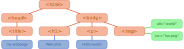

# CTEC3905
## Front-end web development

<div class="flex-center intro">
	
	
	
</div>

### Introduction

<p class="flex-center">
	Dr Graeme Stuart
</p>

-----

<div class="larger"></div>

## A brief history

<div class="flex j-center a-center">
	<figure>
		
		<figcaption>1940's</figcaption>
	</figure>
	<figure>
		
		<figcaption>1960's</figcaption>
	</figure>
	<figure class="flex-col j-between">
		
		<figcaption>1980's</figcaption>
	</figure>
</div>
Snapshots of the 1940's, 1960's and 1980's

-----

## The Memex

Computing, in a practical sense, emerged in the early 20th Century.
Even in the 1940's **human-computer interactions** were being considered in detailed, though as yet **unimplementable** ideas.

<figure>
	
	<figcaption>The Memex is a precursor to the modern personal computer</figcaption>
	<blockquote cite="https://www.theatlantic.com/magazine/toc/1945/07/">
		“Consider a future device …  in which an individual stores all his books, records, and communications, and which is mechanized so that it may be consulted with exceeding speed and flexibility. It is an enlarged intimate supplement to his memory.”
		It consists of a desk, and while it can presumably be operated from a distance, it is primarily the piece of furniture at which he works. On the top are slanting translucent screens, on which material can be projected for convenient reading. There is a keyboard, and sets of buttons and levers. Otherwise it looks like an ordinary desk.
		<strong> — VANNEVAR BUSH, "As We May Think", July 1945</strong>
	</blockquote>

</figure>

-----

## Hypertext

Ted Nelson coined the term **Hypertext** in the 1965.

<figure>
	
	<figcaption>Ted Nelson</figcaption>
	<blockquote cite="https://dl.acm.org/doi/10.1145/800197.806036">
		"THE KINDS OF FILE structures required if we are to use the computer for personal files and as an adjunct to creativity are wholly different in character from those customary in business and scientific data processing. They need to provide the capacity for intricate and idiosyncratic arrangements, total modifiability, undecided alternatives, and thorough internal documentation."
		<strong> — Ted Nelson, "A file structure for the complex, the changing and the indeterminate", August 1965</strong>
	</blockquote>
</figure>

-----

## HyperText

Hypertext is non-linear.
The links are part of the content.

<figure>
	
	<figcaption>Hypertext documents include embedded links to other hypertext documents</figcaption>
</figure>

<blockquote>
	"(...)'Hypertext' is a recent coinage. 'Hyper-' is used in the mathematical sense of extension and generality (as in 'hyperspace,' 'hypercube') rather than the medical sense of 'excessive' ('hyperactivity'). There is no implication about size— a hypertext could contain only 500 words or so. 'Hyper-' refers to structure and not size."
	<strong> — Ted Nelson, "Brief Words on the Hypertext", 23 January 1967</strong>
</blockquote>

-----

## The mother of all demos

By the mid 1960's Douglas Engelbart presented **"the mother of all demos"** showing a practical implementation of some key ideas and technologies.

<figure class="flex j-center">
	
	<ul>
		<li>windows</li>
		<li><strong>hypertext</strong></li>
		<li>graphics</li>
		<li>video conferencing</li>
		<li>the mouse</li>
		<li>word processing</li>
	</ul>
</figure>

...at this time, networked computers existed and the earliest forms of **the internet** were being developed.

-----

## The world-wide web

The **world wide web (www)** was created in 1989 by **Tim Berners-Lee**.

<figure>
	
	<figcaption>Tim Berners-Lee</figcaption>
</figure>

The world-wide web is an open system for publishing **HyperText documents** linked in a web of information served from around the world over the internet.
Other hypertext systems were available but the **open nature** of the world wide web meant that it was able to grow exponentially.

-----

## How the web works

**HyperText Transfer Protocol (HTTP)** is used to access hypertext documents over the internet.
Web servers make documents available as part of the **world wide web** of documents via HTTP.

<figure>
	
	<figcaption>The web uses HTTP over the internet</figcaption>
</figure>

**HyperText Markup Language (HTML)** is used to package content into hypertext documents

A web client (usually a web browser) requests linked resources such as images, fonts, scripts and stylesheets in order to render an HTML document.

-----

## **H**yper**T**ext **M**arkup **L**anguage

HTML is a **markup language** for describing **hypertext** documents.

```html
<!DOCTYPE html>
<html>
	<head>
		<title>My Hypertext Document</title>
	</head>
	<body>
		<h1>Hypertext Documents</h1>
		<p>
			Documents contain
			<a href="http://example.com/another-document">embedded links</a>
			to other documents.
		</p>
	</body>
</html>
```
<figure><figcaption>Its all about the links</figcaption></figure>

-----

## Not just Hypertext: **Hypermedia**

HTML is used to construct documents from linked media files.

```html
<!DOCTYPE html>
<html>
	<head>
		<title>My Hypertext Document</title>
		<link rel="stylesheet" href="http://example.com/styles.css">
	</head>
	<body>
		<h1>Hypermedia!</h1>
		
	</body>
</html>
```
<figure><figcaption>Hypermedia links files</figcaption></figure>

<blockquote>
	By now the word "hypertext" has become generally accepted for branching and responding text, but the corresponding word "hypermedia", meaning complexes of branching and responding graphics, movies and sound – as well as text – is much less used. Instead they use the strange term "interactive multimedia": this is four syllables longer, and does not express the idea of extending hypertext. — Ted Nelson, Literary Machines, 1992
</blockquote>

-----
## The first website(?)

<iframe src="http://info.cern.ch/hypertext/WWW/TheProject.html" height="100%"></iframe>
Visit it [here](http://info.cern.ch/hypertext/WWW/TheProject.html).

-----

## The first browser

[Nexus](http://digital-archaeology.org/the-nexus-browser/), created by Tim Berners-Lee was originally named **WorldWideWeb** but the name was changed to avoid confusion.

<figure>
	
	<figcaption>The Nexus browser - "An exercise in global information availability"</figcaption>
</figure>

The browser provided authoring and editing functionality.
See a demo [here](https://www.youtube.com/watch?v=3c3Rt6QbHDw&feature=youtu.be).

-----
## The modern history - in brief

In the beginning... were the browser wars.
A *Cambrian explosion* of browsers fought for market share.
The **Mosaic browser** won the fight and was eventually renamed to **Netscape Navigator** - *codename: Mozilla*.

<figure>
	
	<figcaption>The Mosaic browser</figcaption>
	<blockquote>
		"There are two ages of the Internet—before Mosaic, and after. The combination of Tim Berners-Lee's Web protocols, which provided connectivity, and Marc Andreesen's browser, which provided a great interface, proved explosive. In twenty-four months, the Web has gone from being unknown to absolutely ubiquitous." — Mark Pesce, ZDNet
	</blockquote>
</figure>


-----

## The first browser war - divergence

<div class="small"></div>

Computing giant **Microsoft** creates <strong>Internet Explorer</strong> and makes it available for free in 1995.
**Netscape Navigator** struggled to remain viable (only free for home and educational use).

<figure>
	
	<figcaption>The first browser war and the beginning of the second</figcaption>
</figure>

Many versions of each browser were released including new proprietary (i.e. non-standard) features including **scripting** and **style sheets**.

-----

## The second browser war - convergence

The Mozilla foundation created the open-source phoenix browser which became firebird and then **firefox**.
Instead of touting proprietary extensions, browsers were marketed based on standards compliance.

<figure>
	
	<figcaption><strong>Firefox</strong> is open-sourced, Google release <strong>Chrome</strong> and mobile browsers are on the rise</figcaption>
</figure>

**Google Chrome** includes faster *javascript* and an open-source version **Chromium**.
The current Microsoft Edge browser is now based on the Chromium code.

-----

## Web standards and open source

Open standards and open source browsers are core to the modern web.
The World Wide Web Consortium develop web standards.

<figure>
	
	<figcaption>The World Wide Web Consortium</figcaption>
</figure>

<blockquote cite=https://www.w3.org/standards/>
	W3C standards define an Open Web Platform for application development that has the unprecedented potential to enable developers to build rich interactive experiences, powered by vast data stores, that are available on any device. - W3C
</blockquote>

-----

## Modern Web browsers

<figure>
	
	<figcaption>Common web browsers</figcaption>
</figure>

-----

## Basic components of a modern web browser

- networking
- rendering engine


-----

## The three languages we will learn

- Content/structure
- Presentation/style
- Behaviour/interaction

-----

## The Document Object Model

The browser requests documents and related content from the web via **HTTP**, parses the HTML and populates the **Document Object Model (DOM)**.

<figure>
	
	<figcaption>Diagram of the Document Object Model (DOM)</figcaption>
</figure>

It also parses style information and populates the **CSS Object Model (CCSOM)**,
combines DOM and CCSOM into the **render tree**, determines the position and size of all elements, and finally paints the pixels to screen
<span class="reference">
	adapted from <a href="https://developer.mozilla.org/en-US/docs/Web/Performance/How_browsers_work">MDN</a>
</span>

-----

## Assignment

<div class="larger"></div>

You will create a website of no more than 4 separate pages (4 distinct screen sections for Single-Page Apps) on a topic of your choice (e.g. portfolio, business, interests, game reviews…). This can be useful for your future and should demonstrate your knowledge of all three front-end languages.

- **Weighting:** 100% of module mark
- **Deadline:** midday Friday 30th April 2021 (week 30)
- **Feedback:** by midday Wednesday 2nd June 2021 (week 35)
- **Submission:** URL for your GitHub classroom repository to the [Assignment submission link on Blackboard](https://vle.dmu.ac.uk/webapps/assignment/uploadAssignment?content_id=_4516063_1&course_id=_551514_1&group_id=&mode=cpview)
